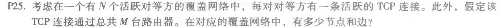

### nslookup www.whu.edu.cn

### 课后练习

#### P13

> smtp种的mail from是smtp协议的一个部分，是一种命令，它表示了发件人的邮箱地址，而且必须与登陆的邮箱地址相同。而该邮件报文本身的
>
> from:首部行是报文自身的一部分，它不一定要与登陆邮箱相同，可以是任意的，而且接收者会看到email地址是首部行的内容，但是注释由mail from的后的邮箱代发。二者无关。
>
> ---

#### P22

> 对于客户服务器而言  
> $$
> t_ {c-s}=max\{N·F/u_{s},F/d_{i}\}
> $$
> 则对于不同的N，最小分发时间表如下：
>
> |  N   |    t    |
> | :--: | :-----: |
> |  10  |  7500s  |
> | 100  |  5000s  |
> | 1000 | 500000s |
>
> 对于P2P而言
> $$
> t_ {P2P}=max\{F/u_{s},F/d_{i},N·F/(u_{s}+∑u_{i})\}
> $$
> 所以P2P的最小分发时间是与u相关的，其图表如下：
>
> |     t     | N=10  | N=100  |  N=1000   |
> | :-------: | :---: | :----: | :-------: |
> | u=0.3Mbps | 7500s | 25000s | 45454.55s |
> | u=0.7Mbps | 7500s | 15000s | 20548.95s |
> |  u=2Mbps  | 7500s | 7500s  |   7500s   |

---

#### P25

> 既然由N个对等方，所以总共有N个节点，而边的数量为N(N-1)/2