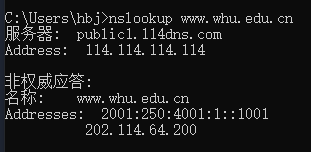
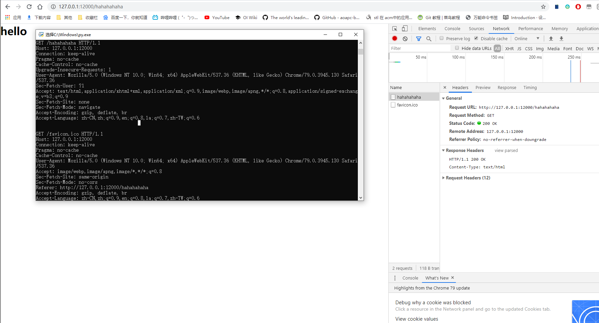

## Homework4
### 1 nslookup www.whu.edu.cn

### P12
代码：
~~~python
from socket import * 

serverPort=12000 
serverSocket=socket(AF_INET,SOCK_STREAM) 
serverSocket.bind(('',serverPort)) 
serverSocket.listen(1) 
while True:
    connSocket,addr = serverSocket.accept()
    sentence = connSocket.recv(1024).decode()
    print(sentence)
    msg = 'HTTP/1.1 200 OK\n\rContent-Type: text/html\n\r\n\r<h1>hello<h1>\n\r'
    connSocket.send(msg.encode())
    connSocket.close()
~~~
没有多的设备，就直接在本地浏览器上请求，结果如下：  

### P13
MAIL FROM是SMTP握手协议中的一部分，在建立SMTP的过程中必不可少，而报文自身内容中的From是属于邮件内容的一部分，是可选部分

### P22
a. 客户-服务器模式:
所需时间$t$：
$$t = max(N*F/u_s, F/d_i)$$
注：此处计算时，有$1Gb = 1024Mb$  
这其中与客户端的上载速率$u$无关，所以在所有$u$的取值下，结果都一样  
计算结果：  
  
| N | t |  
|---|---|
| 10 | 7680 |
| 100 | 51200 |
|1000 | 512000 |

b. p2p模式：
所需时间$t$:  
$$t = max(F/u_s,F/d_i,N*F/(u_s+N*u_i)$$
计算结果：
| N | 300kbps | 700kbps | 2Mbps |
| -| - | - | - |
| 10 | 7680 | 7680 | 7680 |
| 100 | 25903.56 | 15616.20 | 7680 |
| 1000 | 47558.78 | 21524.85 | 7680 |
可见p2p在用户数量增多的情况下，整体消耗的时间增长速度比客户-服务器模式要慢很多。