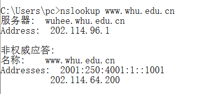
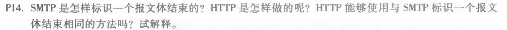
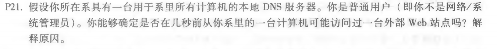

# 网络及分布式计算作业4

## nslookup www.whu.edu.cn

## 习题13

MAIL FROM 是 SMTP 握手协议的一部分，而 From 是邮件报文的一部分。

## 习题14

SMTP 使用仅包含一个句号的一行来标志报文体结束，HTTP 使用 Content-Length 标志。
不能，因为报文内容可能含有句号。

## 习题21

只需要输入这样的命令dig server，把 server 改成你想测试的网站名，如果 Query time 极短，说明最近可能有人访问过该网站。

## 作者

软五 2017301610194 马如云
