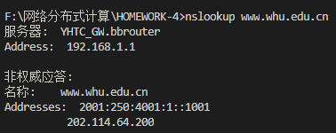
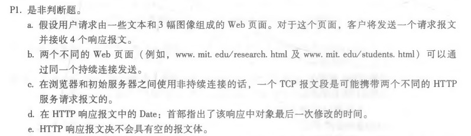
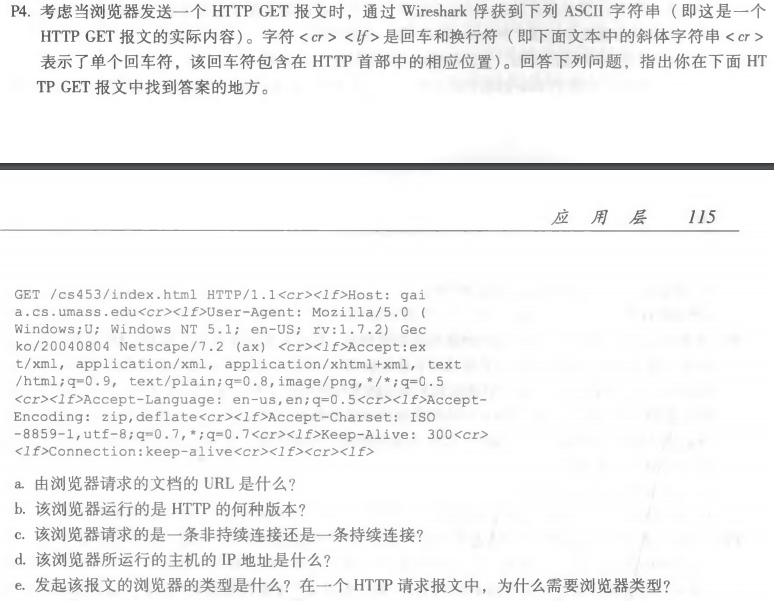
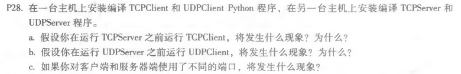

### nslookup

- 解释：nslookup是域名信息的一个非常有用的命令，可以指定查询的类型，可以查到DNS记录的生存时间还可以指定使用哪个DNS服务器进行解释。使用截图图下：

  

******

### Chapter2 Questions

- a：错误
- b：正确
- c：错误
- d：错误
- e：错误

******

- a：文档的URL是：http://gaia.cs.umass.edu/cs453/index.html
- b：HTTP的版本是1.1
- c：由“ Connection: keep-alive”得知请求是一条持续连接
- d：主机的IP在该报文中没有提及，所以无法作答
- e：Mozilla/5.0

- a：如果先运行TCPClient，那么客户机将尝试与一个不存在的服务器进程建立TCP连接，所以建立TCP连接会失败
- b：UDPClient不会与服务器建立连接。因为UDP传送数据前并不与对方建立连接，即UDP是无连接的。如果先运行UDPClient，然后运行UDPServer，然后在键盘上输入一些内容，就会开始连接传输消息
- c：如果使用不同的端口号，客户机将尝试使用错误的进程或不存在的进程建立连接，所以会报错