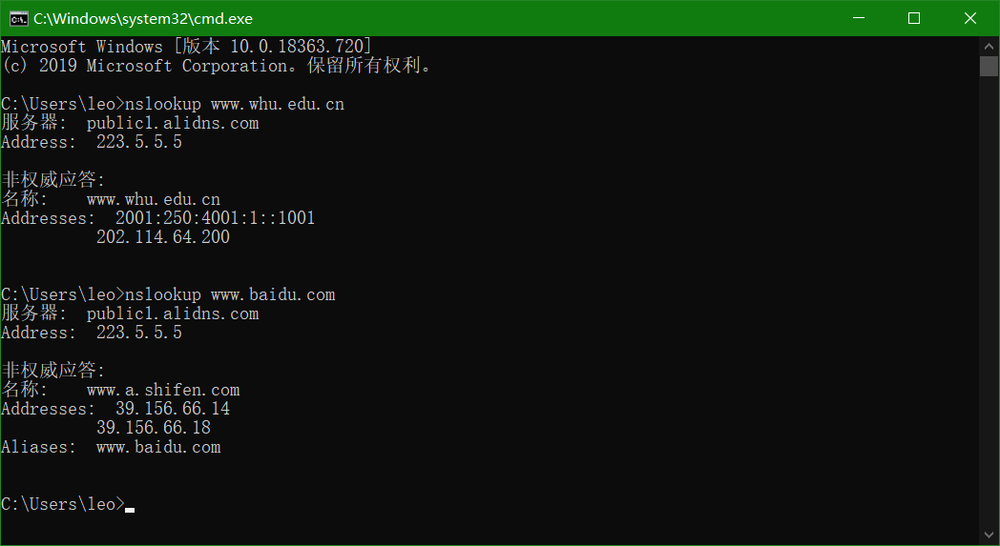
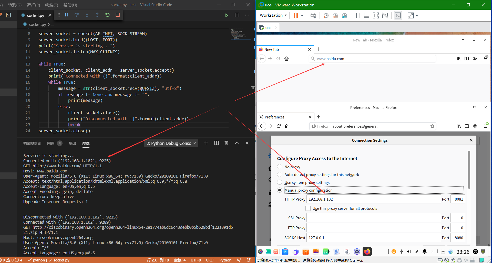

#### 1.nslookup www.whu.edu.cn

nslookup www.whu.edu.cn 与 nslookup www.baidu.com 截图

#### 2.11

a、能。因为Bob并行的连接数更多，可以获得更大的链路带宽，从而更快。

b、 能。若不这样，Bob将获得比其他四个用户更少的带宽；反之会有好处。

#### 2.12

#### 2.13

“MAIL FROM”向服务器指明了邮件的发送者，由「前缀@域名」组成，需要有意义的邮箱地址；

“From”只决定邮件显示时接收方的信息，用户其实可以胡乱填写。

