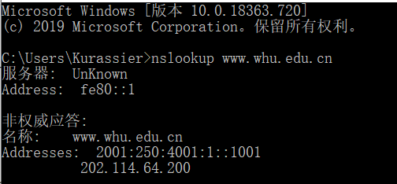

# homework4

nslookup www.whu.edu.cn

---

P10

传播时延：10 / 3 * 108 ≈ 0 故忽略

带有并行连接的非持续连接且并行下载：
(200 / 150) * 3 + (105/ 150) + (200/ (150/ 10)) * 3 + (105 / (150 / 10)) = 7377.3s

持续连接：
(200 / 150) * 3 + (105 / 150) + 10 * (200/150 + 105/150) = 7351s

P13

MAIL FROM 属于SMTP 握手协议的一部分，而邮件报文中的 From : 是其自身的一部分。

P14

a)SMTP 使用仅包含一个句号的一行来标志报文体结束

b)HTTP 使用 Content-Length 标志
c)不能，因为报文内容可能含有同样的内容