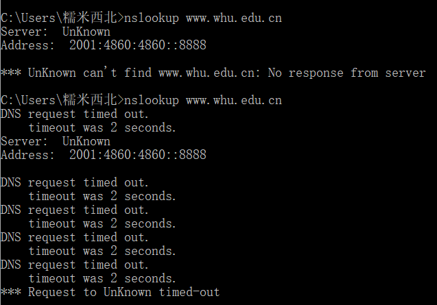
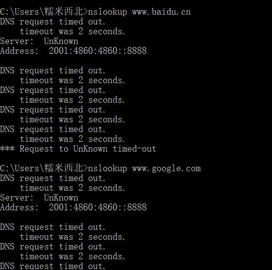

### 2017302580107-肖敏-homework4
1. **nslookup www.whu.edu.cn**

    - 命令：
`nslookup www.whu.edu.cn`
    - 结果：`DNS request timed out`
    
    
    
    - 换个地址尝试域名解析：`nslookup www.baidu.com`
    - 结果：`DNS request timed out`
    
    
    
    - 拓展
    1. 反向解析：IP->解析域名
        `nslookup -qt=ptr 192.168.1.45` 
    2.  查看DNS缓存记录保存时间
        `nslookup -d3 www.baidu.com`
    3. 查看命名服务器NS（一个域名对应多个服务器），由哪个服务器对域名及附属记录进行解析
        `nslookup -qt=ns www.baidu.com`
2. **课后作业题**
    - P6
    ```.env
    a.客户或者服务器都可以发送信令通知连接关闭，实现方式是在http requestreply的Connection-header字段中包含连接令牌“close”
    b. HTTP是不加密的，HTTPS是加密的
    c. 不可以，最多有两条并发的连接
    d. 可能，HTTP/1.1规范地址：https://tools.ietf.org/html/rfc2616
       "A client, server, or proxy MAY close the transport 
        connection at any time. For example, a client might 
        have started to send a new request at the same time 
        that the server has decided to close the "idle" 
        connection. From the server's point of view, the 
        connection is being closed while it was idle, but 
        from the client's point of view, a request is in progress."
    ```
    - P12
    ```
       from socket import * 
       serverPort=12000 
       serverSocket=socket(AF_INET,SOCK_STREAM) #创建TCP附加
       serverSocket.bind(('',serverPort)) #关联端口
       serverSocket.listen(1) #事件监听
       connectionSocket, addr = serverSocket.accept() #创建客户专有连接
       while 1: 
       	sentence = connectionSocket.recv(1024) 
       	print(sentence) #打印
       serverSocket.close() #关闭连接
   ```
   - P25
   ```
   假定该TCP连接通过总共M台路由器，则在对应的覆盖网络中，有N个节点，N(N-1)/2条边
   ```
