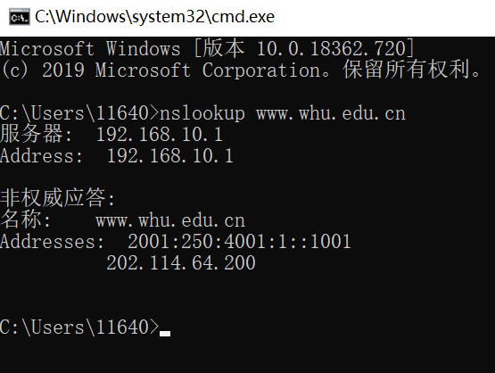
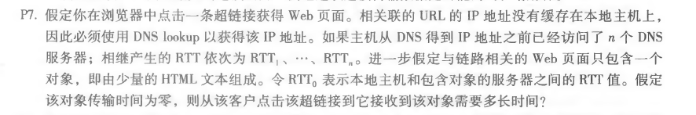
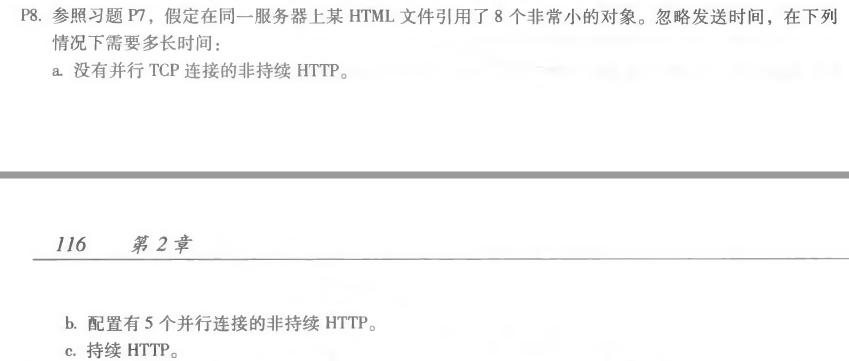
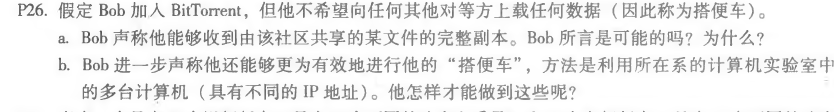

# 第四次作业

+ nslookup www.whu.edu.cn

  

+ 第二章任选3三道题目

  + P7:

    

    获取IP地址的总时间为$ RTT_1+RTT_2+...+RTT_n $

    第一个$RTT_O$内建立TCP连接，第二个$RTT_O$内则会请求和接收小对象。总响应时间为$2*RTT_O+RTT_1+RTT_2+...+RTT_n$

  + P8:

    

    a)$RTT_1+RTT_2+...+RTT_n+2RTT_O+8*2RTT_O=18RTT_O+RTT_1+...+RTT_n$

    b)$RTT_1+RTT_2+...+RTT_n+2RTT_O+2*2RTT_O=6RTT_O+RTT_1+...+RTT_n$

    c)

    + HTTP默认状态，与流水线的持久连接。$RTT_1+RTT_2+...+RTT_n+2RTT_O+RTT_O=3RTT_O+RTT_1+...+RTT_n$

    + 持续连接，无流水线和并行连接。$RTT_1+RTT_2+...+RTT_n+2RTT_O+8RTT_O=10RTT_O+RTT_1+...+RTT_n$

  + P26

    

    a)是可能的，只要洪流中有足够的对等端，且等待时间足够长，Bob可以以乐观非阻塞的方式接收完整文件。

    b)有一种方法是在多个主机上运行客户端，让每个客户端“免费搭乘”，最后将每个主机收集的chunk合并成一个完整文件，有一点并行处理的意味。不过信息可能有冗余，或许可以编写一些调度程序，来对每个主机请求的chunk进行调度，最大化并行效率。

    

    