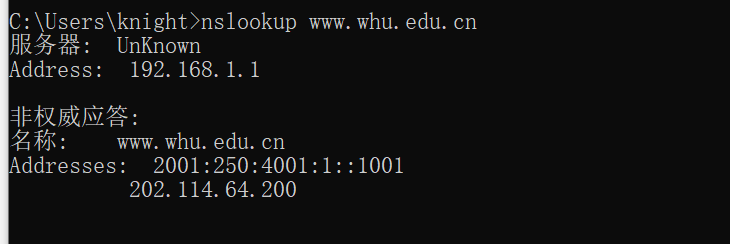

### nslookup
> nslookup命令用于查询DNS的记录，查看域名解析是否正常，在网络故障的时候用来诊断网络问题。
- 

p7:
- 获取IP的总时间为：RTT_1+RTT_2+...+RTT_n
- 加上http往返时间，总时间为 T = RTT_1+RTT_2+...+RTT_n+RTT_0 * 2;

p8:
1. `8*2*RTT_0 + 查询时间 = 16*RTT_0 + RTT_1+RTT_2+...+RTT_n;`
2. `2*3*RTT_0+查询时间 = 6*RTT_0 + RTT_1+RTT_2+...+RTT_n;`
3. `1+8*RTT_0+查询时间 = 9*RTT_0 + RTT_1+RTT_2+...+RTT_n ;`

p20：
- 可以定期查看本地DNS服务器中DNS缓存。查看在DNS缓存中出现最频繁的条目，该条目就是访问最频繁的服务器。
- 原因：这是因为频繁访问的web服务器会不断的出现在缓存中。