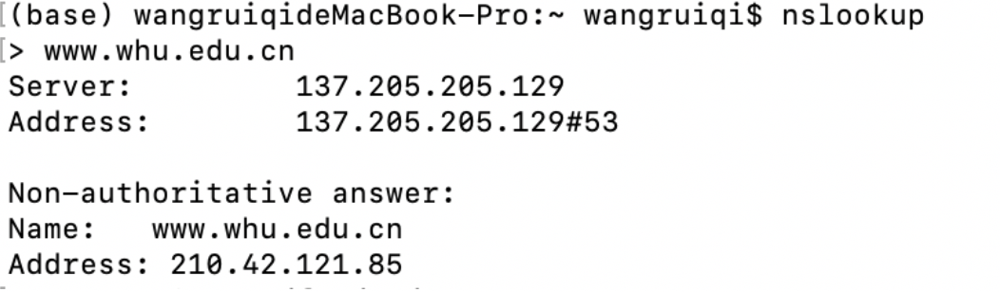

### 任务：nslookup命令

---

nslook : nslookup让因特网服务器管理员或任何的计算机用户输入一个主机名(举例来说，"www.baidu.com") 并发现相应的IP地址。它也会相反的名字查找为一个你指定的 IP 住址找出主机名。

>nslookup www.whu.edu.cn

截图如下：

---

### P13

SMTP中的MAIL FROM是SMTP的一个消息，能用来识别向SMTP服务器发送mail massage的发送者。

而对于THE FROM，它并不是一个STMP消息，它只是mail massage中正文的一行，一部分。

### P23

a.服务器向每个客户端并行发送文件，速率为 us/N.

因为us/N <= dmin,所以每个客户端接收完文件的时间为 F / (us / N) = NF / us

b.由于us/N >= dmin,所以以dmin为速率。us>=Ndmin，服务器可承受此速率。

所以以dmin为下载速率

c.当us/N<=dmin时，N/us>=1/dmin,NF/us>=F/dmin

此时t = NF/us=max{NF/us,F/dmin}

当us/N >=dmin时，N/us<=1/dmin , NF/us<=F/dmin

此时t=F/dmin=max{NF/us,F/dmin}

所以，最小分发时间为 max{NF/us,F/dmin}

### P28:
a) 会报错： `socket.error: [Errno 111] Connection refused` 。因为 Client 尝试连接的 Server 进程不存在，会连接失败。

b) 会正常工作。因为 UDP 不是面向连接的，Client 发送数据前不需要与 Server 建立连接。

c) 同样会报错： `socket.error: [Errno 111] Connection refused` 。因为应用程序与监听的端口号是对应的，如果使用不同的端口号，会使 Client 尝试连接错误的 Server 进程或是不存在的 Server 进程。
