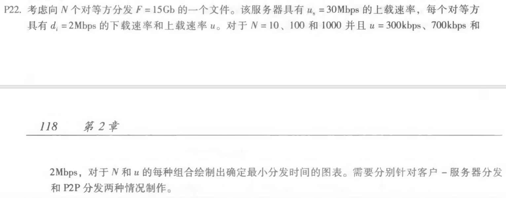

#### 1.nslookup

> nslookup用于查询DNS的记录，查询域名解析是否正常，在网络故障时用来诊断网络问题。

本次作业考察直接查询

> nslookup domain [dns-server]
>
> //如果没有指定的dns服务器，就采用系统默认的dns服务器

查询结果如下：

截图显示出了服务器和地址以及非权威应答的名称以及地址

#### 2.

##### p5.

答：

> a. 状态码 200 和 OK表示服务器能成功找到文档，提供回答在2008年3月7日星期二 格林威治标准时间12:39:45
>
> b.最后一次修改html是2005 年 12 月 10 日 星期六 18:27:46 GMT。
>
> c.返回的文档中有 3874 字节。
>
> d.返回文档的前五个字节为:<!doc。服务器同意持久连接.Connection :Keep-Alive 字段

##### p22.

答：

- 客户-服务器

  与上载速率u无关，t = max{NF/us, F/di}

  |  N   |    t    |
  | :--: | :-----: |
  |  10  |  7500s  |
  | 100  | 50000s  |
  | 1000 | 500000s |

  

- P2P

  t = max{F/us, F/di, NF/(us+Nu)}

  |  u\N   |  10   |  100   |   1000   |
  | :----: | :---: | :----: | :------: |
  | 300kps | 7500s | 25000s | 45454.5s |
  | 700kps | 7500s | 15000s | 20547.9s |
  | 2Mbps  | 7500s | 7500s  |  7500s   |

  

##### p23.

> a. 考虑服务器向客户端同时发送文件 发送速率：u~s~/N 。又因为dmin>=u~s~/N，所以客户端的下载速率为：u~s~/N ，则分发的时间为 F / (u~s~ / N) = NF / u~s~
>
> b. 考虑服务器向客户端同时发送文件 发送速率：dmin。又因为dmin<=u~s~/N，u~s~>=N*dmin，这是符合服务器的要求，客户端也以此速率下载，则分发的时间为F/dmin
>
> c.
>
> - 当u~s~<=dmin时：即是a的情况，t = NF / u~s~= max{NF/us, F/dmin}
> - 当u~s~>=dmin时：即是b的情况，t = F/dmin= max{NF/us, F/dmin}
>
> 综合来看得出最小分发时间为 max{NF/us，F/dmin}