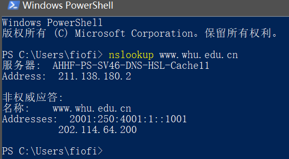

## 1. `nslookup www.whu.edu.cn`

## 2. 作业题

- **P11**

~~~
a)是，因为连接数更多，所以链路带宽份额更大
b)是，Bob仍然需要执行并行下载；否则，他将获得比其他四个用户更少的带宽
~~~

- **P12**

~~~py
from socket import *
port=12000
server=socket(AF_INET,SOCK_STREAM)
server.bind('',port)
server.listen(1)
while True:
	conn,addr=socket.accept()
	message=server.recv(1024).decode()
	print(message)
~~~

- **P20**

~~~
可以定期拍摄本地DNS服务器中DNS缓存的快照，在DNS缓存中出现最频繁的Web服务器就是最流行的服务器。因为如果更多的用户对Web服务器感兴趣，那么DNS请求就会对此感兴趣服务器更频繁地由用户发送。
~~~

