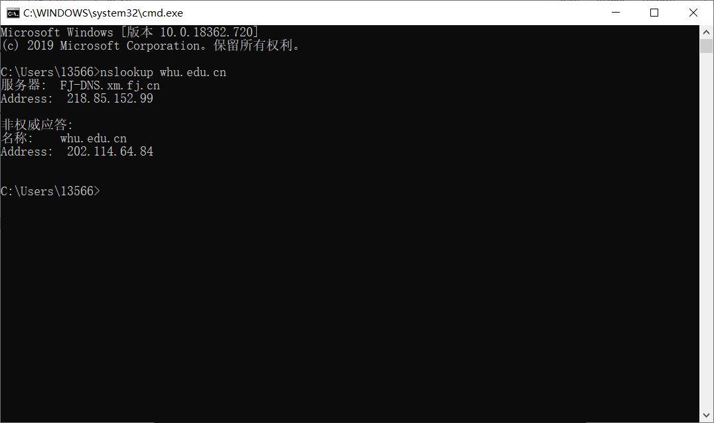

# 网络及分布式计算第四次作业

## nslookup

nslookup是一种网络管理命令行工具，可用于查询DNS域名和IP地址输入指令nslookup默认服务器和Address是当前上网所用的DNS服务器域名和地址A记录A（Address）记录指的是用来指定主机名或域名对应的IP记录。

## 课后习题

### P11

a)是的，因为Bob有更多的连接，他可以获得更大的链路带宽份额。

B)是的，Bob仍然需要执行并行下载；否则，他将获得比其他四个用户更少的带宽。

### P13

来自:inSMTP的邮件是从SMTP客户端发送的标识发件人的邮件将邮件消息发送到SMTP服务器。

发件人：在邮件消息本身不是SMTP邮件，而不是邮件正文中的一行。

###  P15

MTA代表邮件传输代理。主机将消息发送给MTA。然后，该消息遵循一系列MTA以到达接收者的邮件阅读器。我们看到这个垃圾邮件遵循一个MTA链。诚实的MTA应该报告它收到消息的位置。请注意，在此消息中，“asusus-4b96([58.88.21.177])”不报告它收到电子邮件的位置。由于我们假定只有发端人是不诚实的，所以“asusus-4b96([58.88.21.177])”必须是发起人。

