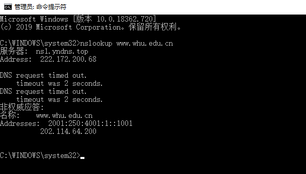

### 1.nslookup www.whu.edu.cn 

​    nslookup是一种网络管理命令行工具，可用于查询DNS域名和IP地址输入指令nslookup默认服务器和Address是当前上网所用的DNS服务器域名和地址A记录A（Address）记录指的是用来指定主机名或域名对应的IP记录。

​              在命令行输入以下指令：

​             `nslookup www.whu.edu.cn `

### 2.第二章习题

##### p10

带有并行连接的非持续连接且并行下载：
(200b / 150bps) * 3 + ((10^5)b/ 150bps) + (200b / (150bps / 10)) * 3 + ((10^5)b / (150bps / 10)) = 7377.3s

持续连接：
(200b / 150bps) * 3 + ((10^5)b / 150bps) + 10 * (200b/150bps + (10^5)b/150bps) = 7351s

##### p15

MTA即为邮件传输代理；
产生垃圾邮件的恶意主机是58.88.21.177

##### p23

a.
当服务器向每个客户端并行发送文件，且速率为 us/N，其中因为 us/N <= dmin，所以客户端也以该速率下载。则每个客户端接收完文件的时间为 F / (us / N) = NF / us
b.
若服务器向每个客户端并行发送文件，并且以 dmin 为速率，其中因为 us/N >= dmin，所以 us >= Ndmin，则服务器可以承受此速率，故接收时间为 F/dmin
c.
当 us/N <= dmin 时：
        N/us >= 1/dmin
        NF/us >= F/dmin
        此时 t = NF/us = max{NF/us, F/dmin}
当 us/N >= dmin 时：
        N/us <= 1/dmin
        NF/us <= F/dmin
        此时 t = F/dmin = max{NF/us, F/dmin}
因此：得出最小分发时间为 max{NF/us，F/dmin}

