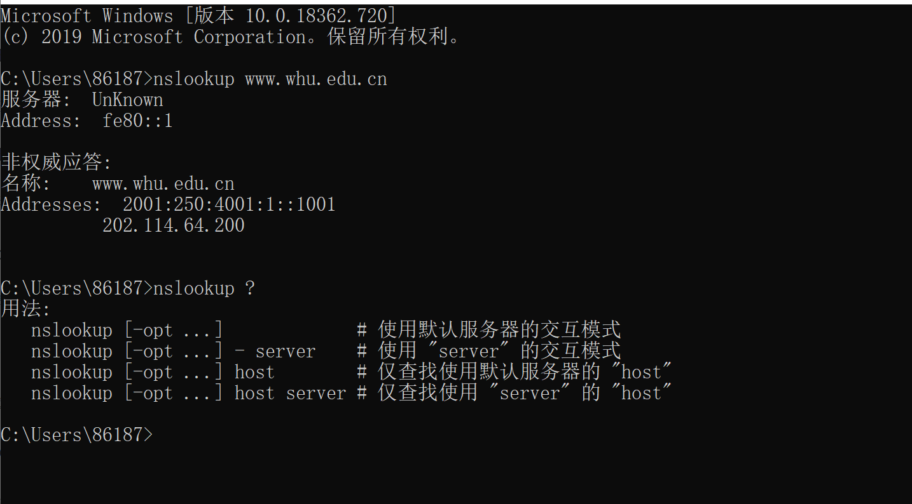
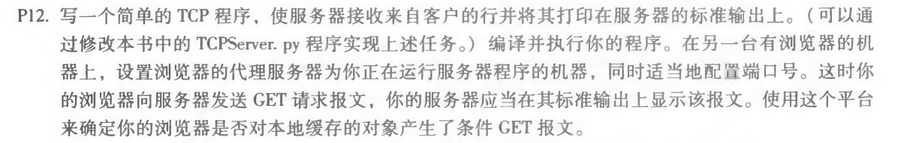
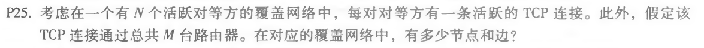

## 1.nslookup www.whu.edu.cn

NSLOOKUP是NT、2000中连接DNS服务器，查询域名信息的一个非常有用的命令，可以指定查询的类型，可以查到DNS记录的生存时间还可以指定使用哪个DNS服务器进行解释。在已安装TCP/IP协议的电脑上面均可以使用这个命令。主要用来诊断域名系统 (DNS) 基础结构的信息。



## 2.课本习题：

#### 第十二题



```python
from socket import *
import threading
def Accept(ConnectionSocket, Addr):
	Message = ConnectionSocket.recv(1024).decode('utf-8', 'ignore')
	print(Message)
	ConnectionSocket.send('haha'.encode('utf-8', 'ignore')) 
	ConnectionSocket.close()

ServerPort = 10000
ServerSocket = socket(AF_INET, SOCK_STREAM) 
ServerSocket.bind(('',ServerPort))
ServerSocket.listen()
print('listening...')
while 1:
	ConnectionSocket, Addr = ServerSocket.accept() 
	t = threading.Thread(target=Accept, args=(ConnectionSocket, Addr))
	t.start()

```


启动程序后，设置代理，重新刷新之前打开的页面，会收到报文。

```
GET http://httpd.apache.org/ HTTP/1.1
Host: httpd.apache.org
...
If-Modified-Since: Sat, 22 Sep 2018 11:41:57 GMT
...
```


#### 第十三题


 A:MAIL FROM 是 SMTP 握手协议的一部分，而 From 是邮件报文的一部分。

#### 第二十五题



A:有N个节点。N(N-1)/2条边。
