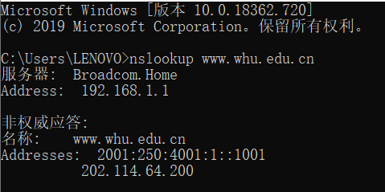

## nslookup
nslookup用于查询DNS域名和IP地址,指令nslookup默认服务器和Address是当前上网所用的DNS服务器域名和地址。Address）记录指的是用来指定主机名或域名对应的IP记录。在提示符后直接输入域名，可以查看该域名的Address记录  

## 课后习题  
### p5: 
a:浏览器成功找到了那个文档。根据Date: Tue所得。回答的时间为响应浏览器的时间07 Mar 2008  
b:最后修改时间为Sat, 10 Dec 2005 18:27:46 GMT。根据Last-Modified的值而得  
c:被返回的字节为3874，根据Content-Length所得  
d:前五个字节为<!doc，服务器同意一条持续连接根据keep-alive可看出  

### P7
得到IP地址的时间 为各段时间之和：RTT1 + RTT2 + … + RTTn
三次握手加上最后的响应为：2\*RTT0
故总时长为： 2\*RTT0 + RTT1 + RTT2 + … + RTTn 

### P13

MAIL FROM 是 SMTP 协议的一部分，From 是邮件报文的一部分
