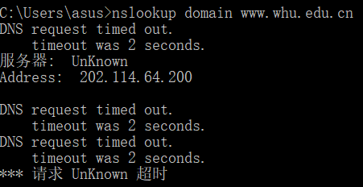

#第四次作业
本次做一些计算题 

**P7-假定你在浏览器中点击一条超链接获得Web页面。相关联的URL的IP地址没有缓存在本地主机上, 因此必须使用DNS lookup以获得该IP地址。如果主机从DNS得到IP地址之前已经访问了 n个DNS 服务器；相继产生的RTT依次为RTT|、…、RTT“。 进一步假定与链路相关的Web页面只包含一个 对象，即由少量的HTML文本组成。令RTT。表示本地主机和包含对象的服务器之间的RTT值。假定 该对象传输时间为零，则从该客户点击该超链接到它接收到该对象需要多长时间？**

解答：得到IP地址的时间 = RTT1 + RTT2 + … + RTTn  
中转时间 = 2 RTT0  
因此总共是 2 RTT0 + RTT1 + RTT2 + … + RTTn  

**P&参照习题P7,假定在同一服务器上某HTML文件引用了 8个非常小的对象。忽略发送时间，在下列 情况下需要多长时间： a.没有并行TCP连接的非持续HTTP。  
b.配置有5个并行连接的非持续HTTP。  
c.持续 HTTPO**  
  
解答：类似7，分段相加即可，下面只给出计算过程  
a.2RTT0 + RTT1 + RTT2 + … + RTTn + 8 * 2 RTT0 = 18 RTT0 + RTT1 + RTT2 + … + RTTn  
b.2RTT0 + RTT1 + RTT2 + … + RTTn + 2 * 2 RTT0 = 6 RTT0 + RTT1 + RTT2 + … + RTTn  
c.2RTT0 + RTT1 + RTT2 + … + RTTn + RTT0 = 3 RTT0 + RTT1 + RTT2 + … + RTTn  

**P9.考虑图2-12,其中有一个机构的网络和因特网相连。假定对象的平均长度为850000比特，从这个机 构网的浏览器到初始服务器的平均请求率是每秒16个请求。还假定从接入链路的因特网一侧的路由 器转发一个HTTP请求开始，到接收到其响应的平均时间是3秒（参见2.2.5节）。将总的平均响应 时间建模为平均接人时延（即从因特网路由器到机构路由器的时延）和平均因特网时延之和。对于 平均接入时延，使用1/（1-细），式中△是跨越接入链路发送一个对象的平均时间，0是对象对该 接入链路的平均到达率。  
a. 求出总的平均响应时间。  
b. 现在假定在这个机构LAN中安装了一个缓存器。假定命中率为0.4,求出总的响应时间**  
解答：a.  
Δ = 850000b / 15Mbps = 0.0567s
β = 16q/s
t接 = Δ/1-Δβ = 0.61s
t总 = t接 + t因 = 3.61s

b.  
β’ = 16q/s * 60%
t接’ = Δ/1-Δβ = 0.12s
当命中缓存器时: t命中 = 850000b / 100Mbps = 0.0085s
因此 t总’ = 0.4 * 0.0085 + 0.6*(t接’ + t因) = 1.8754s  
  
**nslookup测试**  
  
查到了202.114.64.200
此外，nslookup指令参考资料记录如下：https://blog.csdn.net/xg_ren/article/details/80782338

