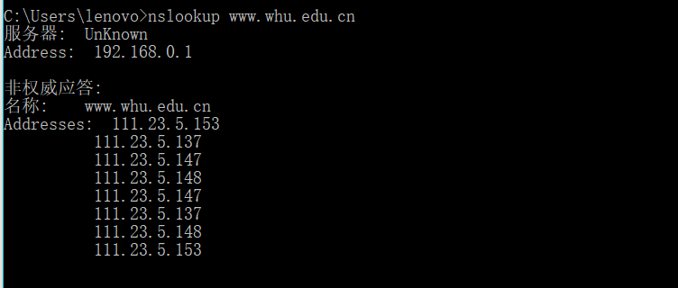

## 分布式计算与网络第三次作业

### 1. nslookup www.whu.edu.cn


解析：nslookup 发送域名查询包给指定的（或默认的）域名系统（DNS）服务器, 默认值可能是使用的服务提供商的本地的DNS名字服务器，一些中间名字服务器，或者整个域名系统层次的根服务器系统,最终返回查询所得的域名ip以及查询所经过的服务器群ip。


### 2. 习题

#### p22
```
1.客户-服务器模式
由于在C/S模式下，客户都不需要上传文件，则分类与u无关， t = max{NF/us, F/di}
N	    t
10	  7500s
100	 50000s
1000	500000s
2.P2P模式
t = max{F/us, F/di, NF/(us+Nu)}
      N	    10	  100	   1000
u				
300kps		7500s	25000s	45454.5s
700kps		7500s	15000s	20547.9s
2Mbps		 7500s	7500s	 7500s

```
#### p25
```
由于每个对等方都有一个TCP连接，那么此图构成完全连通图，有N个节点和N*(N-1)/2条边

```

#### p28
```
a.将会报错，抛出ConnectionRefusedError异常，因为连接时，服务器端监听端口未打开无法连接
b.无影响
c.TCP无法连接

```
