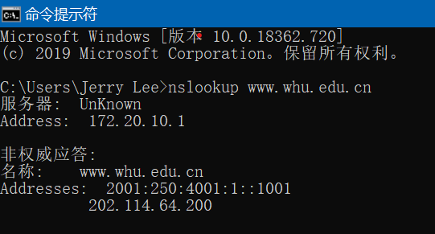

# 网络与分布式计算作业4

## nslookup www.whu.edu.cn

## 第二章课后题

### P10

非持续HTTP连接且并行下载：(200b / 150bps) x 3 + ((100000)b/ 150bps) + (200b / (150bps / 10)) x 3 + ((100000)b / (150bps / 10)) = 7377.34s

持续HTTP连接： (200b / 150bps) x 3 + ((10000)b / 150bps) + 10 x (200b/150bps + (100000)b/150bps) = 7350.67s

### P11

a) 能，因为他连接数更多，链路带宽更大。

B) 仍有好处，不然他的带宽相较其他四个用户更少。

### P25

有N个节点和N(N-1)/2条边