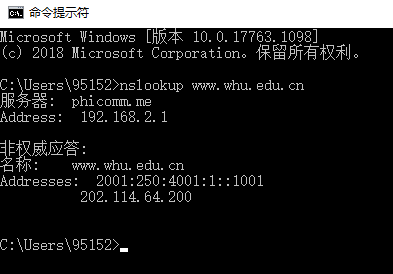

**9.** **考虑图2-12,其中有一个机构的网络和因特网相连。假定对象的平均长度为850000比特，从这个机构网的浏览器到初始服务器的平均请求率是每秒16个请求。还假定从接入链路的因特网一侧的路由器转发一个HTTP请求开始，到接收到其响应的平均时间是3秒 (参见2.2.5节)。将总的平均响应时间建模为平均接入时延(即从因特网路由器到机构路由器的时延)和平均因特网时延之和。对于平均接入时延，使用△/(1-△ß)，式中△是跨越接入链路发送一个对象的平均时间，ß是对象对该接入链路的平均到达率。**

**a.** **求出总的平均响应时间。**

平均因特网时延为3s

△=850000bits/15Mbps=0.0567s  ß=16个/s

平均接入时延为△/(1-△ß)=0.6110s

总的平均响应时间=平均因特网时延+平均接入时延=3.6110s

**b.** **现在假定在这个机构LAN中安装了一个缓存器。假定命中率为0.4,求出总的响应时间。**

缓存时延LAN =0.0085s

当ß的值为16x0.6=9.6时,平均接入时延=△/(1-△ß)=0.1244s

总的平均响应时间=(平均因特网时延+平均接入时延)x0.6+0.4xLAN =1.8780s

 

**10.** **考虑一条10米短链路，某发送方经过它能够以150bps速率双向传输。假定包含数据的分组是 100 000比特长，仅包含控制（如ACK或握手）的分组是200比特长。假定N个并行连接每个都获 得1/W的链路带宽。现在考虑HTTP协议，并且假定每个下载对象是】00Kb长，这些初始下载对象 包含10个来自相同发送方的引用对象。在这种情况下，经非持续HTTP的并行实例的并行下载有意 义吗？现在考虑持续HTTP。你期待这比非持续的情况有很大增益吗？评价并解释你的答案。**

带有并行连接的非持续连接且并行下载： 

(200b / 150bps) * 3 + ((10^5)b/ 150bps) + (200b / (150bps / 10)) * 3 + ((10^5)b / (150bps / 10)) = 7377.3s

持续连接： 

(200b / 150bps) * 3 + ((10^5)b / 150bps) + 10 * (200b/150bps + (10^5)b/150bps) = 7351s

 

**25.** **考虑在一个有N个活跃对等方的覆盖网络中，每对对等方有一条活跃的TCP连接。此外，假定该 TCP连接通过总共M台路由器。在对应的覆盖网络中，有多少节点和边？**

节点：N

边：N(N-1)/2