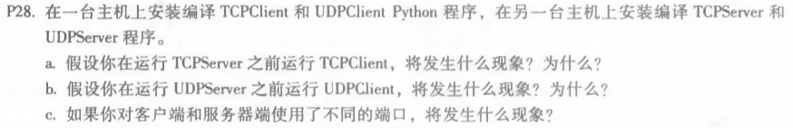

# 网络及分布式计算

##*第四次作业*

---------------------------------------------  
### 一. nslookup www.whu.edu.cn 

 

### 二.  第二章课后题任选三题  

####  P13  

##### 答：  

MAIL FROM是SMTP协议的一部分，此命令告诉接收者新的发送操作已经开始，请复位所有状态表和缓冲区，如果请求被接收，接收方返回一个250 OK应答；而From：只是邮件报文的一部分。

####  P25  
  
  

##### 答：  
有N个节点，N(N-1)/2条边。  

#### P28  
  
  

#### 答:  
a.TCP连接将无法完成。原因：那么客户机试图与不存在的服务器进程建立TCP连接。  
b.不会出错。原因：UDP不需要建立连接，不需要等待UDPServer的开启。  
c.会出错。原因：客户机将会试图和一个错误的进程或一个不存在的进程建立TCP连接。

