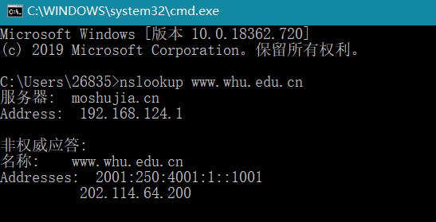

# 作业

## 2017302580295 刘晓林  

### nslookup测试 

---

### 习题 P8

> a. 没有并行TCP连接的非连续HTTP：2RTT0 + RTT1 + RTT2 + … + RTTn + 8 * 2 RTT0 = 18 RTT0 + RTT1 + RTT2 + … + RTTn  
> b. 配置有5个并行连接的非持续HTTP：2RTT0 + RTT1 + RTT2 + … + RTTn + 2 * 2 RTT0 = 6 RTT0 + RTT1 + RTT2 + … + RTTn  
> c. 持续HTTP：2RTT0 + RTT1 + RTT2 + … + RTTn + RTT0 = 3 RTT0 + RTT1 + RTT2 + … + RTTn  

### 习题 P9
>a.  
> 平均因特网时延 = 3s  
> △ = 850000bits / 15Mbps = 0.0567s  
> ß = 16个/s  
> 平均接入时延 = △ / (1 - △ß) =0 .6110s  
> 总的平均响应时间 = 平均因特网时延 + 平均接入时延 = 3.6110s  
> b.  
> LAN缓存时延 = 850000bits / 100Mbps = 0.0085s  
> 由a公式当ß的值为16 x 0.6 = 9.6时,平均接入时延 = △ / (1 - △ß) = 0.1244s  
> 总的平均响应时间 = (平均因特网时延 + 平均接入时延) x 0.6 + 0.4 x LAN缓存时延 = 1.8780s  

### 习题 P25
> 在对应的覆盖网络中，有N个节点和N(N-1)/2条边  
