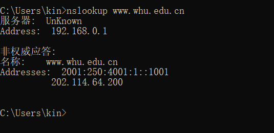

## 第四次作業  2017312580243-蔣梓健

> 1. nuslookup www.whu.edu.cn 
>
>    答案: 

> ### 第二部分 
>
> P22、在计算客户端-服务器分发的最小分发时间时，我们使用以下公式：
>
> $d_{cs}=max{NF/u_s，F/d_{min}}$。
>
> 同样地，在计算P2P分发的最小分发时间时，我们使用以下公式：
>
> $D_{p2p}=max{F/u_s，F/d_{min}，NF/(u_s+\sum_{i=1}^{N}u_i)}$
>
> 其中F=15Gbit=15*1024Mbit
>
> u_s=30 Mbps
>
> $d_{min}=d_i$=2 Mbps，
>
> 其中300 Kbps=300/1024 Mbps。
>
> Client Server N 10 100 1000 u 300 Kbps 7680 51200 512000 700 Kbps 7680 51200 512000 2 Mbps 7680 51200 512000
>
> Peer to Peer N 10 100 1000 u 300 Kbps 7680 25904 47559 700 Kbps 7680 15616 21525 2 Mbps 7680 7680 7680
>
> P23、
>
> a)考虑一种分发方案，其中服务器以$u_s/N$的速率并行地向每个客户端发送文件，注意此速率低于客户端的每个下载速率，因为假设我们$u_s/N≤d_{min}$。因此，每个客户端也可以以$u_s/N$的速率接收，因为每个客户端以$u_s/N$的速率接收，每个客户端接收整个文件的时间是$F/(u_s/N)=NF/u_s$。由于所有客户端都在$NF/u_s$中接收文件，所以总的分发时间也是$NF/u_s$。
>
> b)考虑一种分发方案，其中服务器并行地向每个客户端发送文件，速率为$d_{min}$。注意，聚合速率N $d_{min}$小于服务器的链接速率我们，因为假设我们$u_s/N≥d_{min}$。由于每个客户端以$d_{min}$的速率接收，每个客户端接收整个文件的时间是$F/d_{min}$。因为所有客户端都在这段时间内接收文件，所以整个分发时间也是$F/d_{min}$。
>
> P27、
>
> a)n文件，假设我们通过将视频版本与音频版本按质量和速率的顺序配对来进行一对一的匹配。
>
> b)2N个文件。

